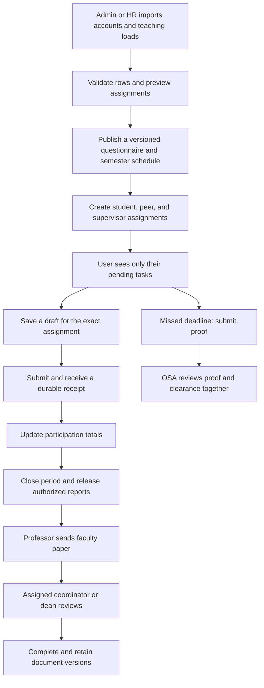

Review of the NAAP evaluation system, completed September 13, 2026.

Several confirmed defects should be fixed before expanding usage. Keep the PHP/MySQL foundation and improve the existing application incrementally. The most urgent work is protecting faculty documents, preserving submitted answers, preventing concurrent saves from overwriting each other, and making the interface report persistence failures accurately.

This review covers the major authentication, account management, evaluation, draft, OSA clearance, faculty paper, reporting, notification, and role-panel paths. It combines source review, local HTTP access checks, read-only database inspection, syntax checks, a Composer dependency audit, and isolated reproductions. It is not a claim that every possible bug has been found or that production capacity has been measured. Existing application changes were preserved; this review added only files under `.codex/reviews`.

The meaning of “5,000 users” and production hosting were not confirmed, so both account count and simultaneous usage are considered below. The local database had 200 accounts at inspection, with no empty-password accounts. That dataset does not demonstrate capacity for 5,000 users.

The priorities used here are P1: fix before broader production use, and P2: fix in the next reliability release. “Reproduced” means the failing behavior was observed using the local server or an isolated harness. “Code-confirmed” means the current execution path establishes the defect; the destructive or security-sensitive scenario was not performed against live accounts.

| Priority | Finding and evidence | Consequence and recommended correction |
|---|---|---|
| P1 | **Faculty PDFs are accessible without login.** An unauthenticated HEAD request to an existing generated PDF returned HTTP 200 and `application/pdf`. Storage is public at [faculty_pdf_helper.php:757](C:/xampp/htdocs/system/api/faculty_pdf_helper.php:757), while authorization exists only in [faculty_paper_file.php:34](C:/xampp/htdocs/system/api/faculty_paper_file.php:34). | Anyone with the direct file URL can bypass the intended access checks. Store generated documents outside the web root, or deny direct access to their directory and serve them exclusively through the authenticated endpoint. Document contents were not downloaded during verification. |
| P1 | **Deleting questionnaire questions can delete historical answers.** Removed questions are deleted at [state_helpers.php:2774](C:/xampp/htdocs/system/api/state_helpers.php:2774). The answer-to-question foreign key uses `ON DELETE CASCADE` in [datacode.txt:474](C:/xampp/htdocs/system/database/datacode.txt:474); this rule was also confirmed in the running database. | Editing a questionnaire can silently remove answers from already submitted evaluations. Freeze versions after publication or first submission, retain referenced questions, and use a new version for changes. Existing question text and rating maximum can also be edited in place at [state_helpers.php:2587](C:/xampp/htdocs/system/api/state_helpers.php:2587), changing the meaning of history. |
| P1 | **Concurrent users overwrite shared records.** Proof submission reads the shared list at [state_helpers.php:5450](C:/xampp/htdocs/system/api/state_helpers.php:5450) and replaces it at line 5478. Login security similarly replaces a global JSON setting at [state_helpers.php:12320](C:/xampp/htdocs/system/api/state_helpers.php:12320). Both races were reproduced with interleaved calls to the current helpers. | Two different proof submissions both returned successfully, but only one remained stored. Two different login-security updates also left only one record. Move proofs, clearances, login counters, OTP challenges, and announcement read receipts into separate SQL rows with appropriate unique keys and atomic updates. |
| P1 | **The interface reports successful saves after failures.** [db-data.js:4280](C:/xampp/htdocs/system/JsScrip/db-data.js:4280) changes cached evaluation dates, catches the server error, and returns normally. [adminpanel.js:12149](C:/xampp/htdocs/system/JsScrip/adminpanel.js:12149) then announces success. A simulated HTTP 500 reproduced the incorrect local state. | An administrator can believe an evaluation period changed while students still receive the old server policy. Await successful persistence before committing shared cache changes and showing success. Keep editable unsaved input separate from confirmed server state. Similar error swallowing exists for current-semester and general-settings changes. |
| P1 | **The backup button does not perform a backup.** The visible button in [adminpanel.html:797](C:/xampp/htdocs/system/html/adminpanel.html:797) is connected to an alert only at [adminpanel.js:5540](C:/xampp/htdocs/system/JsScrip/adminpanel.js:5540). | Clicking it claims an archive was created when no backup operation occurs. Remove the success claim immediately, then implement a real backup job with an artifact, completion status, retention, and a tested restore procedure. This does not establish whether separate hosting backups exist. |
| P1 | **Finishing one evaluation can clear another draft.** The delayed callback at [studentpanel.js:3679](C:/xampp/htdocs/system/JsScrip/studentpanel.js:3679) clears whichever draft is current when it runs. [studentpanel.js:2709](C:/xampp/htdocs/system/JsScrip/studentpanel.js:2709) resolves that current context. | An isolated navigation-timing reproduction submitted offering A, switched to B, and cleared B's draft. Capture the submitted draft key and form generation before the request. Clear only A, and reset the displayed form only if it still represents A. Remove artificial submission delays. |
| P1 | **Password recovery does not revoke existing sessions or clear recovery-related challenges.** [login.php:479](C:/xampp/htdocs/system/api/login.php:479) updates the password and token usage but leaves active-session fields and login security state intact. | A session using the old credentials remains valid after recovery, and a surviving session or lock can impede the account owner's return. Invalidate existing session tokens and pending OTP challenges during recovery; apply a deliberate policy for clearing account lock state. Code-confirmed; no live account was reset. |
| P1 | **Anonymous failed attempts can impose a two-hour account lock.** Wrong passwords trigger a challenge at [login.php:704](C:/xampp/htdocs/system/api/login.php:704); wrong OTP submissions impose the lock at [login.php:660](C:/xampp/htdocs/system/api/login.php:660). Correct-password handling is blocked by the existing challenge. | Someone who knows an account identifier can interrupt the owner's access without knowing the password. Add account and source throttling, progressive delays, recovery controls, and a challenge flow that does not let an unauthenticated caller disable legitimate login. Reset-mail requests also need throttling. No actual account was locked during this review. |
| P2 | **OSA decisions and clearances can disagree.** [state_helpers.php:5525](C:/xampp/htdocs/system/api/state_helpers.php:5525) saves the decision before creating its clearance and allows a later rejection without reconciling that clearance. | Reproductions produced both “rejected but still cleared” and “approved with no clearance” after an injected storage failure. Save decision and clearance in one transaction. Define permitted transitions, require explicit reversal handling, and preserve the review history. |
| P2 | **Passwords are changed during login.** Reset stores raw input at [login.php:425](C:/xampp/htdocs/system/api/login.php:425); login trims and strips tags at [login.php:689](C:/xampp/htdocs/system/api/login.php:689). Own-password changes also store raw input. | Valid newly saved passwords containing boundary spaces or tag-like text can subsequently fail login. The actual hashing and verification functions reproduced this mismatch with synthetic passwords. Preserve password bytes consistently and apply validation independently of HTML sanitization. |
| P2 | **A reset token can succeed twice concurrently.** Token validity is checked at [login.php:437](C:/xampp/htdocs/system/api/login.php:437), before the transaction starts at line 477. | Two requests can pass the check and each set a different password. Begin the transaction before reading and locking the token; atomically consume it and verify one successful consumption. The current transaction alone does not prevent the earlier check from becoming stale. |
| P2 | **Deactivated HR/admin sessions can still use the legacy user listing.** [users.php:25](C:/xampp/htdocs/system/api/users.php:25) checks identity and role, but omits the account-status check used by the main API. | A previously authenticated deactivated account can continue reading this endpoint until its session is invalidated elsewhere. Centralize active-account authorization for every protected endpoint and revoke sessions on deactivation. |
| P2 | **Reports assume every rating scale is 1–5.** [faculty_report_helper.php:226](C:/xampp/htdocs/system/api/faculty_report_helper.php:226) clamps values to five and multiplies their average by twenty. Configuration accepts maxima up to ten at [state_helpers.php:2384](C:/xampp/htdocs/system/api/state_helpers.php:2384). | A supported 5/10 response produced 100% in the isolated report calculation; it should be 50% under the existing percentage-of-maximum convention. Either restrict all questionnaires to the mandated scale, or normalize by each question's saved scale and apply a documented weighting rule. This matters when non-five-point scales are used. |
| P2 | **Temporary bootstrap failures become false readiness.** [db-data.js:2195](C:/xampp/htdocs/system/JsScrip/db-data.js:2195) sets `initialized = true` after failure, and subsequent ordinary calls return true without retrying. | A reproduced 503 followed by a normal retry made only one request: the first returned false and the second incorrectly returned true. Keep failed initialization distinct from successful initialization and provide bounded retries and an actionable error state. |
| P2 | **Cached data can represent an older query or another tab's old state.** [db-data.js:2558](C:/xampp/htdocs/system/JsScrip/db-data.js:2558) applies every user response to one shared array; [db-data.js:4638](C:/xampp/htdocs/system/JsScrip/db-data.js:4638) forwards storage events without updating the corresponding in-memory state. | Reproductions showed an older search overwriting a newer result, and a new-semester event while the getter still returned the old semester. Cache by query and scope, ignore obsolete responses using request generations, and invalidate or refresh in-memory state on cross-tab changes. The evaluation cache has the same shared-array design. |
| P2 | **Evaluation pagination reports misleading metadata.** [state_helpers.php:15643](C:/xampp/htdocs/system/api/state_helpers.php:15643) returns the page length as `total` and always sets `hasMore` to false. | A limited result is reported as the complete result even when more evaluations exist. Use a scoped count query or fetch one extra row for a cursor-based next-page indicator. Preserve identical authorization filters for the data and count queries. |
| P2 | **Failed reminder jobs cannot retry that day.** [state_helpers.php:13399](C:/xampp/htdocs/system/api/state_helpers.php:13399) skips solely by date, while line 13473 records that date before SMTP configuration and delivery succeed. | The isolated reproduction returned “skipped” for a same-day job whose previous status was “error.” Track claimed, running, completed, and failed work separately. Retry failed recipients with a lease and stable delivery identity; overlapping workers must not both claim the same job. |
| P2 | **Submission time is supplied by the browser.** [state_helpers.php:4220](C:/xampp/htdocs/system/api/state_helpers.php:4220) accepts a parseable client `submittedAt` or `timestamp` as the stored submission time. | A wrong client clock or modified payload can create inaccurate history and reports. Stamp receipt time on the server, keeping any client time in a separate optional field. This does not by itself bypass the server's evaluation-period check. |
| P2 | **New-account creation can accept an empty password.** [state_helpers.php:1329](C:/xampp/htdocs/system/api/state_helpers.php:1329) defaults a missing new password to an empty value; [db.php:137](C:/xampp/htdocs/system/api/db.php:137) accepts empty input for empty stored credentials. | A reachable account-creation defect can create a passwordless account. Require valid credentials or an expiring account-activation flow. Read-only inspection found zero existing empty-password accounts, so this is not a claim that current accounts have empty passwords. |
| P2 | **The installed FPDI version has a published security advisory.** Both the lockfile and installed metadata identify 2.6.6 at [composer.lock:133](C:/xampp/htdocs/system/composer.lock:133). Composer audit reports CVE-2026-45802. | Update to a maintained patched release compatible with the application and regenerate representative reports. The maintainer identifies 2.6.7 as the first fixed release. The reviewed import paths use bundled templates, so an attacker-controlled PDF route was not demonstrated; the affected dependency is confirmed. [Maintainer advisory](https://github.com/Setasign/FPDI/security/advisories/GHSA-2mgw-7q6p-8grg). |

The shared-record races are particularly relevant to expansion: PHP's session lock is per session, so it does not serialize different students saving to the same global JSON record. An atomic replacement of that JSON value does not make the earlier read-and-modify sequence atomic. Prefer one row per independent record. A short transaction with a locking read can protect a remaining read/modify/write operation during migration, but a single global row remains a contention point. [MySQL locking-read documentation](https://dev.mysql.com/doc/refman/8.4/en/innodb-locking-reads.html).

The proposed workflow gives each office a clear next action and makes the database authoritative for completion:



| Workflow | Improvement to implement | Why it helps |
|---|---|---|
| Account and teaching-load imports | Stage the upload, validate references and duplicates, show a preview and row errors, then process a resumable batch with a stable import ID. Prefer activation links to distributing reusable passwords. | Makes large imports reviewable and allows safe retry without duplicate users or assignments. |
| Semester preparation | Use an explicit readiness check: assignments present, questionnaire published, dates valid, recipients configured, and supervisor routes complete. Lock the published questionnaire version. | Prevents opening an evaluation period with missing prerequisites and protects historical meaning. |
| Student evaluation | Show one task per enrollment, a clear saved/pending/failed draft state, and a receipt containing the saved evaluation ID and server time. A retry should resolve to the same submission. | Users can distinguish drafts from submissions and recover safely from a lost network response. Keep the existing database duplicate key. |
| Peer and supervisor evaluation | Resolve the assigned evaluator and target from the server's assignment records, validate the role and scope centrally, and update assignment completion with the submission transaction. | Keeps department/program ownership consistent and reduces conflicting implementations between role panels. |
| OSA review | Provide a paginated pending-review inbox. Commit the decision, review event, and clearance change together. Treat reversals as explicit audited actions. | Reduces reconciliation work and prevents contradictory statuses. |
| Faculty papers | Define explicit transitions such as draft, submitted, returned for revision, completed, and archived. Record versions and the assigned reviewer; reject edits based on an obsolete version. | Prevents two reviewers or browser tabs from silently replacing each other's work. Protect generated files independently of the UI. |
| HR/VPAA analytics | Request totals and grouped statistics from SQL, then load individual records only when the user opens a detail view. Generate large exports in background jobs. | Keeps dashboards responsive as evaluation history grows. |
| Notifications and backups | Use persisted jobs with progress, failure details, retry controls, and completion artifacts. Send reminders only to users with remaining assignments. | Removes long waits and makes operational success verifiable. |

For scaling, the strongest existing foundations are prepared SQL statements, role-scoped bootstrap data, targeted SQL evaluation and draft persistence, transactional answer insertion, duplicate-submission constraints, and existing performance indexes. Keep those improvements. The application does not need a wholesale rewrite or microservices merely to hold 5,000 accounts.

The largest remaining capacity risks are specific:

1. **Some dashboards undo the small bootstrap by fetching everything afterwards.** OSA requests all active students plus semester-wide offerings and evaluations at [osapanel.js:120](C:/xampp/htdocs/system/JsScrip/osapanel.js:120). VPAA does similarly at [vpaapanel.js:747](C:/xampp/htdocs/system/JsScrip/vpaapanel.js:747). Replace these with scoped aggregate endpoints and paginated drill-downs. Professor/dean evaluation listing can also materialize all scoped evaluations before slicing at [state_helpers.php:15606](C:/xampp/htdocs/system/api/state_helpers.php:15606). Enforce server-side limits and move the scope filters into SQL before pagination.

2. **The browser still performs many blocking requests.** [db-data.js:1586](C:/xampp/htdocs/system/JsScrip/db-data.js:1586) uses synchronous XMLHttpRequest for operations including reports, SMTP actions, settings, and several evaluation workflows. Convert call chains to asynchronous requests, show progress, guard repeat submissions, and avoid applying results to a view that has changed. Synchronous requests block browser interaction while waiting. [MDN documentation](https://developer.mozilla.org/en-US/docs/Web/API/XMLHttpRequest_API/Synchronous_and_Asynchronous_Requests).

3. **Long work occupies request workers and holds the user's session lock.** Sessions start at [auth.php:43](C:/xampp/htdocs/system/api/auth.php:43), with no `session_write_close()` found in the application APIs. Finish required session updates and release the session before long work. Queue bulk email, large exports, and AI analysis; return a job ID for progress. PHP documents that a locked session permits only one script to operate on that session at a time. [PHP documentation](https://www.php.net/manual/en/function.session-write-close.php).

4. **Credential delivery holds a database transaction open while contacting SMTP.** [state_helpers.php:13035](C:/xampp/htdocs/system/api/state_helpers.php:13035) begins the transaction; delivery occurs at line 13043 and commit at line 13053. This holds account locks during network delays, and delivered mail cannot be rolled back if commit subsequently fails. Create the activation/reset operation and an outbox record in a short transaction, then deliver from a worker with retry tracking. Design the flow so repeated delivery remains safe.

5. **Time lookup can add external network latency to ordinary requests.** [time_helper.php:49](C:/xampp/htdocs/system/api/time_helper.php:49) contacts internet time services after cache expiry. Concurrent cache misses can all make those calls, and failure is not cached across requests. Synchronize the host clock operationally and use server time in request processing; if a remote check is needed, refresh it outside user requests.

6. **The largest modules combine many unrelated responsibilities.** The reviewed `state_helpers.php` has approximately 16,100 lines, `app_state.php` 5,600, and the admin and HR panel scripts about 13,400 and 11,500. Split them gradually into accounts, assignments, questionnaires, submissions, clearance, reporting, and jobs. Share form validation and request handling across panels, while retaining server authorization. This makes fixes easier to test and reduces divergent behavior.

A practical target architecture remains one modular PHP application with a relational database, bounded web workers, background job workers, and private document storage. Use a shared cache/session store when deploying multiple application instances, and keep documents available to each authorized instance. Introduce additional instances based on measured demand. Connection limits, worker counts, and memory budgets must be configured together; blindly increasing workers can exhaust the database.

The local CLI environment reported PHP 8.2.12, MariaDB 10.4.32, file-based sessions, and no enabled OPcache value in that CLI configuration. These are local observations, not a complete production configuration audit. Verify the web-server configuration separately, use supported patched runtime versions, configure opcode caching, and deploy with a dedicated database account. The application's development fallback is a root database account with an empty password at [db.php:24](C:/xampp/htdocs/system/api/db.php:24). Production configuration must override that fallback. Choose hosting resources after measuring this workload; the shared-hosting suggestion in `DEPLOYMENT.md` is not capacity evidence.

Capacity planning should use the following separate scenarios. All figures below are planning examples, not measured throughput:

| Scenario | Workload implication | Validation required |
|---|---|---|
| 5,000 registered accounts | Storage and ordinary directory size are manageable design concerns; peak active usage determines request capacity. | Seed at least 5,000 synthetic accounts and realistic assignment/history volumes, then test expected peak activity. |
| 5,000 students with eight assigned evaluations each | About 40,000 submissions per semester; at 30 answer rows each, approximately 1.2 million answer rows per semester. | Test queries, indexes, pagination, report calculations, and exports against this answer volume and multiple terms of history. |
| 5,000 simultaneously active users | At the configured one-minute heartbeat cadence, heartbeat traffic alone averages about 83 requests/second, before page loads, drafts, or submissions; actual sending depends on visibility and activity gates. | Model distinct sessions, login surges, realistic think time, drafts, deadline bursts, reporting, and email concurrently. Add heartbeat jitter to reduce synchronized bursts. |

Load testing belongs in a separate staging environment with synthetic accounts and a mail sink. Ramp concurrent-user tests through 100, 250, 500, 1,000, and then the required peak, stopping on material errors or saturation. Also test an arrival-rate workload so requests continue arriving when the system slows; otherwise a user-loop test can hide overload by generating less traffic. Run a sustained test and a deadline burst, and account for dropped iterations in the load generator. [k6 arrival-rate documentation](https://grafana.com/docs/k6/latest/using-k6/scenarios/executors/constant-arrival-rate/) and [dropped iterations](https://grafana.com/docs/k6/latest/using-k6/scenarios/concepts/dropped-iterations/).

Suggested acceptance targets, to agree against the real hosting environment: p95 under one second for normal API reads and draft saves, p95 under two seconds for final submission, no lost or duplicate committed submissions, and under 1% unexpected request failures. Track p99 as well, plus database lock waits, slow queries, CPU, memory, connection usage, worker saturation, and background queue age. Count expected validation or permission rejections separately from server failures. Large reports should return a job promptly and finish within a defined report-generation target.

The implementation order should be dependency-aware:

1. Protect private documents; eliminate the false backup claim; guard historical questionnaires; fix the wrong-draft cleanup; fix credential/session defects. Add focused regression coverage for these paths before changing their behavior.
2. Move shared mutable records into SQL tables and introduce atomic review transitions, single-use recovery tokens, and version checks. Make frontend errors visible and repair stale cache/bootstrap behavior. Correct report normalization and pagination metadata.
3. Add a job/outbox mechanism, resumable imports, pending-only reminders, aggregate dashboard endpoints, scoped pagination, and asynchronous browser requests. Use short database transactions and release session locks appropriately.
4. Establish staging, automated validation, backups with restore drills, deployment migration checks, dependency auditing, error monitoring, and the realistic load tests above. Size and tune production based on those results.

Validation completed during this review:

| Check | Result |
|---|---|
| PHP syntax | All 25 application PHP files checked successfully. |
| JavaScript syntax | All 13 first-party JavaScript files checked successfully. |
| Schema migration check | All 15 declared migrations reported applied; no pending migration. Only `--check` was run. |
| Unauthenticated API checks | Bootstrap and user listing returned 401. Database and Git paths and setup endpoint returned 403. Web migration execution returned 405. |
| Private document access | A direct generated PDF URL returned 200 without authentication: confirmed defect. |
| Dependency audit | One advisory for installed FPDI 2.6.6; no dependency update was applied. |
| Read-only database inspection | Confirmed questionnaire-answer cascading deletion; 200 accounts and zero empty-password accounts at inspection. |
| Isolated backend probes | Reproduced lost proof and login-security updates, inconsistent approval/clearance states, failed-job retry suppression, and incorrect custom-scale reporting. |
| Isolated frontend probes | Reproduced silent failed saves, stale cross-tab state, out-of-order query replacement, false bootstrap readiness, and wrong-draft cleanup. |

The isolated probes execute selected current application code with synthetic state and fake database/network objects. They demonstrate the reported behavior without accessing live account data, writing to the application database, or sending email. They print observations rather than asserting that the application is correct; an exit code of zero means the probe ran, not that the defect is fixed.

They can be rerun from the repository root:

```powershell
& 'C:\xampp\php\php.exe' .codex\reviews\backend-audit-probes-2026-09-12.php
node .codex\reviews\frontend-audit-probes-2026-09-12.js
```

Several areas need follow-up testing during implementation: end-to-end role workflows in real browsers; multi-session authorization and recovery tests; lost-response submission retries; opening and closing evaluation periods at their boundaries; historical-semester requests whose period is absent and falls back to global settings; faculty-paper concurrency; and a full database-plus-file restore. Existing login logs contained four MySQL “server has gone away” errors, but their cause was not established. No production load test, real mail delivery, destructive questionnaire edit, or live password reset was performed.

Prepared statements, bcrypt hashing, CSRF checks, session-ID rotation, hashed session/reset tokens, image MIME validation, role restrictions, SQL draft persistence, and duplicate evaluation constraints are valuable existing safeguards. Preserve them while applying the targeted corrections above. The immediate recommendation is to complete the P1 fixes before adding users, then prove the intended peak workload through staging tests.
